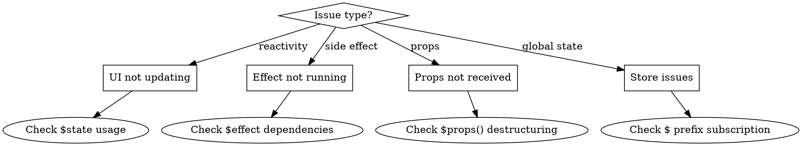

# Svelte 5 Debugging

## Overview

Systematic approach to debug Svelte 5 issues. Use `$inspect()` for reactive debugging. Always check rune usage first.

## Debugging Decision Flow



## Issue: UI Not Updating

**Symptoms:** Data changes but UI stays same

**Debug Steps:**
1. Add `$inspect()` to track value
2. Check if using `$state()`
3. Check mutation vs reassignment

```svelte
<script lang="ts">
  // DEBUG: Add inspect
  let items = $state<string[]>([]);
  $inspect('items:', items);

  function addItem(text: string) {
    // BAD: Won't work without $state
    // items.push(text);

    // GOOD with $state: mutations work
    items.push(text);

    // GOOD without $state: reassign
    // items = [...items, text];
  }
</script>
```

**Common Causes:**
| Symptom | Cause | Fix |
|---------|-------|-----|
| Array not updating | No `$state()` + mutation | Add `$state()` or reassign |
| Object prop not updating | Shallow check | Use `$state()` for deep reactivity |
| Derived not recalculating | Wrong dependencies | Check `$derived()` expression |

## Issue: Effect Not Running

**Symptoms:** Side effect doesn't execute

**Debug Steps:**
1. Check if dependencies are reactive (`$state` or `$derived`)
2. Add `$inspect()` before effect
3. Check if effect returns cleanup properly

```svelte
<script lang="ts">
  let count = $state(0);

  // DEBUG: Inspect to verify reactivity
  $inspect('count before effect:', count);

  $effect(() => {
    console.log('Effect ran, count:', count);
    // Dependencies auto-tracked!
  });

  // BAD: Non-reactive variable
  let staticVar = 0;
  $effect(() => {
    console.log(staticVar); // Won't re-run!
  });
</script>
```

**Common Causes:**
| Symptom | Cause | Fix |
|---------|-------|-----|
| Never runs | Dependency not reactive | Use `$state()` |
| Runs once | No reactive read inside | Access reactive var in body |
| Cleanup not called | No return statement | Return cleanup function |

## Issue: Props Not Received

**Symptoms:** Props undefined or wrong value

**Debug Steps:**
1. Check parent passes prop correctly
2. Check `$props()` destructuring
3. Check default values

```svelte
<!-- Parent.svelte -->
<Child name="John" count={5} />

<!-- Child.svelte -->
<script lang="ts">
  interface Props {
    name: string;
    count?: number;
  }

  // DEBUG: Log all props
  let props = $props<Props>();
  $inspect('all props:', props);

  // Correct destructuring
  let { name, count = 0 }: Props = $props();
</script>
```

**Common Causes:**
| Symptom | Cause | Fix |
|---------|-------|-----|
| Prop undefined | Wrong prop name | Check spelling |
| Type error | Missing interface | Add Props interface |
| Always default | Parent not passing | Check parent component |

## Issue: Store Not Syncing

**Symptoms:** Store updates but component doesn't reflect

**Debug Steps:**
1. Check `$` prefix in template
2. Check subscription in script
3. Check store is exported correctly

```svelte
<script lang="ts">
  import { user } from '$lib/stores/auth';

  // GOOD: Auto-subscribe with $:
  $: currentUser = $user;

  // Or direct in template: {$user.name}
</script>

<!-- Template -->
<p>Name: {$user?.name}</p>
```

**Common Causes:**
| Symptom | Cause | Fix |
|---------|-------|-----|
| No updates | Missing `$` prefix | Add `$` before store |
| Stale data | Manual subscription | Use `$:` or `$store` |
| Type errors | Store not typed | Add generic to writable |

## Quick Debug Tools

```svelte
<script lang="ts">
  let data = $state({ name: 'test' });

  // 1. Basic inspect
  $inspect(data);

  // 2. Labeled inspect
  $inspect('data state:', data);

  // 3. Trace function calls
  function updateData() {
    $inspect.trace('updateData called');
    data.name = 'updated';
  }

  // 4. Check component lifecycle
  $effect(() => {
    console.log('Component mounted/updated');
    return () => console.log('Cleanup');
  });
</script>
```

## Anti-Pattern Checklist

Before debugging, check these common mistakes:

- [ ] Using `export let` instead of `$props()`
- [ ] Using `$:` reactive statement instead of `$derived()`
- [ ] Mutating array without `$state()`
- [ ] Missing `lang="ts"` in script tag
- [ ] Using old slot syntax instead of snippets
- [ ] Not using `$` prefix for store access
- [ ] Effect without cleanup for listeners

## When Stuck

1. **Use Svelte MCP:** `svelte__svelte_autofixer` to check code
2. **Read docs:** `svelte__get_documentation` for specific topic
3. **Isolate:** Create minimal reproduction
4. **Compare:** Check against working example in docs

## Red Flags - STOP Debugging Wrong Thing

| Thought | Reality |
|---------|---------|
| "Let me add console.log everywhere" | Use `$inspect()` instead - reactive aware |
| "The logic must be wrong" | Check rune syntax first - 80% of bugs |
| "I'll rewrite from scratch" | Systematic debug is faster |
| "It worked before" | Svelte 5 migration issues are common |

## Rationalization Table

| Excuse | Reality |
|--------|---------|
| "I'll debug without MCP tools" | MCP autofixer catches syntax issues instantly |
| "I know what's wrong" | Verify assumptions with `$inspect()` first |
| "Just a quick fix" | Quick fixes often miss root cause |

**Always: `$inspect()` → Check runes → MCP autofixer**
