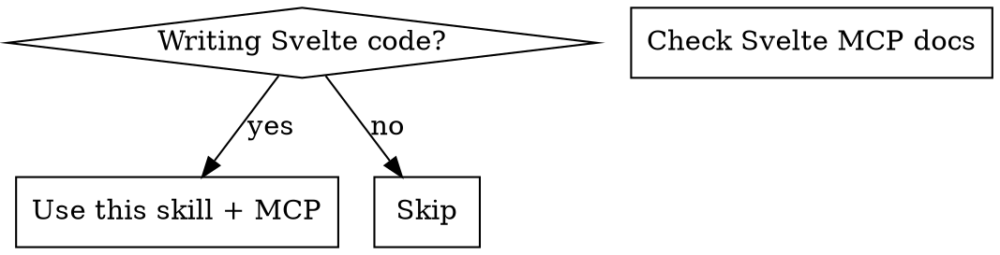
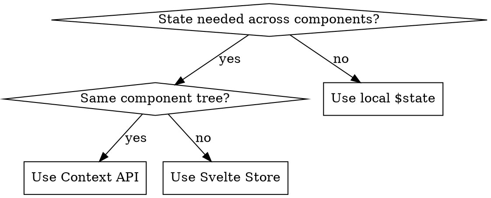

# Svelte 5 Programming

## Overview

Svelte 5 uses **Runes** for reactivity. Always use TypeScript. Always consult Svelte MCP tools (`svelte__list_sections`, `svelte__get_documentation`) for syntax verification.

## When to Use



**Use when:** Creating components, handling reactivity, state management, debugging UI updates
**Skip when:** Non-Svelte code

## Core Patterns

### Props with TypeScript (ALWAYS)

```svelte
<script lang="ts">
  interface Props {
    variant?: 'primary' | 'secondary';
    size?: 'sm' | 'md' | 'lg';
    disabled?: boolean;
    onclick?: () => void;
  }

  let { variant = 'primary', size = 'md', disabled = false, onclick }: Props = $props();
</script>
```

**Red Flags:**
- Missing `lang="ts"` → Add it
- `export let` syntax → Convert to `$props()`
- No interface → Create Props interface

### Runes Quick Reference

| Rune | Purpose | Example |
|------|---------|---------|
| `$state(val)` | Reactive state (objects/arrays auto-deep) | `let count = $state(0)` |
| `$derived(expr)` | Computed value | `let doubled = $derived(count * 2)` |
| `$derived.by(fn)` | Complex computed | `let result = $derived.by(() => {...})` |
| `$effect(() => {})` | Side effects with cleanup | Auto-tracks dependencies |
| `$props()` | Component props | `let { name }: Props = $props()` |
| `$inspect(val)` | Debug logging (dev only) | `$inspect('user:', user)` |

### Array/Object Reactivity

```svelte
<!-- $state makes mutations reactive -->
<script lang="ts">
  let todos = $state<string[]>([]);

  function addTodo(text: string) {
    todos.push(text);  // Works! $state handles mutation
  }

  function removeTodo(index: number) {
    todos.splice(index, 1);  // Works!
  }
</script>
```

**Without $state:** Must reassign (`todos = [...todos, text]`)

### State Management Decision



**Context API:**
```svelte
<!-- Parent -->
<script lang="ts">
  import { setContext } from 'svelte';
  interface User { id: string; name: string; }

  const user: User = { id: '1', name: 'John' };
  setContext<User>('user', user);
</script>

<!-- Any Child -->
<script lang="ts">
  import { getContext } from 'svelte';
  const user = getContext<User>('user');
</script>
```

**Store (Global):**
```typescript
// lib/stores/auth.ts
import { writable } from 'svelte/store';
export const user = writable<User | null>(null);

// Component - auto-subscribe with $
$: currentUser = $user;
```

### Children/Slots (Svelte 5)

```svelte
<!-- Svelte 5: Use snippets -->
<script lang="ts">
  import type { Snippet } from 'svelte';

  interface Props {
    children: Snippet;
  }

  let { children }: Props = $props();
</script>

<div class="wrapper">
  {@render children()}
</div>
```

### Effects with Cleanup

```svelte
<script lang="ts">
  let count = $state(0);

  $effect(() => {
    const handler = () => console.log('resize');
    window.addEventListener('resize', handler);

    return () => {  // Cleanup
      window.removeEventListener('resize', handler);
    };
  });
</script>
```

## Common Mistakes

| Mistake | Fix |
|---------|-----|
| `export let prop` | Use `let { prop } = $props()` |
| `$: doubled = x * 2` | Use `let doubled = $derived(x * 2)` |
| Array not updating | Use `$state([])` or reassign |
| Missing cleanup in effect | Return cleanup function |
| No TypeScript | Add `lang="ts"` and Props interface |
| Guessing syntax | Check Svelte MCP docs first |

## Required Workflow

**BEFORE writing Svelte code:**
1. Call `svelte__list_sections` to find relevant docs
2. Call `svelte__get_documentation` for specific syntax
3. Use `svelte__svelte_autofixer` after writing to verify

**DO NOT guess Svelte 5 syntax. Always verify with MCP tools.**

## Red Flags - STOP and Check Docs

These thoughts mean you're about to make a mistake:

| Thought | Reality |
|---------|---------|
| "I'll use export let for props" | Svelte 5 uses `$props()`, not `export let` |
| "I'll use $: for reactivity" | Svelte 5 uses `$derived()` for computed values |
| "Array push should work" | Only with `$state()`, otherwise reassign |
| "I remember the syntax" | Svelte 5 changed significantly. Check MCP docs. |
| "This is simple, no need to check" | Simple mistakes are common. Always verify. |
| "I'll skip TypeScript for speed" | TypeScript prevents bugs. Always use it. |

## Rationalization Table

| Excuse | Reality |
|--------|---------|
| "Time pressure, I'll fix later" | Wrong syntax causes more debugging time |
| "Old syntax still works" | Old syntax creates inconsistent codebase |
| "MCP check is slow" | 5 seconds check saves 30 minutes debug |
| "I know Svelte well" | Svelte 5 is different from Svelte 4 |

**All of these mean: Check MCP docs first. No exceptions.**
